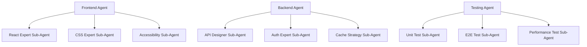

# 🎭 TACO v2.0 Complete Orchestration Flow

## Overview
TACO v2.0 maintains the original parallel orchestration with dependency graphs while adding Claude's advanced features including /memory, sub-agents, MCP, and thinking modes.

## Architecture Diagram

```
┌─────────────────────────────────────────────────────────────────┐
│                     MOTHER ORCHESTRATOR (Window 0)              │
│  - Creates dependency graph                                     │
│  - Manages /memory system                                       │
│  - Coordinates parallel execution                               │
│  - Uses think modes for architecture                            │
└─────────────────┬───────────────────────────────────────────────┘
                  │
      ┌───────────┴───────────────────────────────────┐
      │                                               │
┌─────▼─────────┐  ┌──────────────┐  ┌──────────────▼──────────┐
│   Monitor     │  │Test Monitor  │  │   Dependency Graph      │
│  (Window 1)   │  │ (Window 2)   │  │   & Memory System       │
│               │  │              │  │                         │
│ - Live status │  │ - Test runs  │  │ DEPENDS_ON: frontend    │
│ - Metrics     │  │ - Coverage   │  │ NOTIFIES: testing       │
│ - Progress    │  │ - Results    │  │ PARALLEL_WITH: backend  │
└───────────────┘  └──────────────┘  └─────────────────────────┘
                                                │
                  ┌─────────────────────────────┼─────────────────────────────┐
                  │                             │                             │
         Phase 1 (Parallel)              Phase 2 (Dependent)          Phase 3 (Final)
    ┌──────────┴──────────┐         ┌──────────┴──────────┐     ┌──────────┴──────────┐
    │                     │         │                     │     │                     │
┌───▼────┐  ┌────────┐  ┌▼───────┐ │   ┌────────┐       │     │    ┌────────┐      │
│Frontend│  │Database│  │Backend │ │   │Testing │       │     │    │Deploy  │      │
│Agent 3 │  │Agent 5 │  │Agent 4 │ │   │Agent 6 │       │     │    │Agent 7 │      │
│        │  │        │  │        │ │   │        │       │     │    │        │      │
│/memory │  │/memory │  │/memory │ │   │/memory │       │     │    │/memory │      │
│/agents │  │/agents │  │/agents │ │   │/agents │       │     │    │/agents │      │
└────────┘  └────────┘  └────────┘ └───┴────────┘       └─────┴────┴────────┘
     │           │           │              │                          │
     └───────────┴───────────┴──────────────┴──────────────────────────┘
                        Communication Protocol
                    (Message Relay + Shared Memory)
```

## Complete Orchestration Flow

### Phase 0: Initialization (Mother Orchestrator)

```bash
# 1. Mother analyzes project requirements
taco -p "Build e-commerce platform"

# 2. Mother uses thinking mode for architecture
"ultrathink and design the system architecture"

# 3. Mother creates agent specification with dependencies
AGENT_SPEC_START
AGENT:3:frontend:React UI developer:claude
DEPENDS_ON:none
NOTIFIES:testing
PARALLEL_WITH:backend,database
MEMORY_SHARE:backend,testing

AGENT:4:backend:API developer:claude
DEPENDS_ON:database
NOTIFIES:frontend,testing
WAIT_FOR:schema_ready
MEMORY_SHARE:frontend,database,testing

AGENT:5:database:Database architect:claude
DEPENDS_ON:none
NOTIFIES:backend
PARALLEL_WITH:frontend
MEMORY_SHARE:backend

AGENT:6:testing:Test engineer:claude
DEPENDS_ON:frontend,backend
NOTIFIES:deployment
WAIT_FOR:api_ready,ui_ready
MEMORY_SHARE:all

AGENT:7:deployment:DevOps engineer:claude
DEPENDS_ON:testing
WAIT_FOR:tests_passing
MEMORY_SHARE:none
AGENT_SPEC_END
```

### Phase 1: Dependency Graph Construction

The system builds an execution plan:

```json
{
  "execution_phases": [
    {
      "phase": 1,
      "agents": ["frontend", "database"],
      "parallel": true,
      "dependencies": []
    },
    {
      "phase": 2,
      "agents": ["backend"],
      "parallel": false,
      "dependencies": ["database"]
    },
    {
      "phase": 3,
      "agents": ["testing"],
      "parallel": false,
      "dependencies": ["frontend", "backend"]
    },
    {
      "phase": 4,
      "agents": ["deployment"],
      "parallel": false,
      "dependencies": ["testing"]
    }
  ]
}
```

### Phase 2: Agent Initialization with Claude Features

Each agent is launched with full Claude capabilities:

```bash
# For each agent, TACO executes:

# 1. Navigate to workspace
tmux send-keys -t taco:3 "cd /project/frontend" Enter

# 2. Start Claude with continuation
tmux send-keys -t taco:3 "claude --continue" Enter

# 3. Initialize memory system
tmux send-keys -t taco:3 "/memory add agent_name 'frontend'" Enter
tmux send-keys -t taco:3 "/memory add role 'React UI developer'" Enter
tmux send-keys -t taco:3 "/memory add phase '1'" Enter

# 4. Create specialized sub-agents
tmux send-keys -t taco:3 "/agents create react-expert 'React hooks and state management'" Enter
tmux send-keys -t taco:3 "/agents create css-expert 'Responsive design and animations'" Enter
tmux send-keys -t taco:3 "/agents create test-writer 'React Testing Library expert'" Enter

# 5. Enable MCP servers
tmux send-keys -t taco:3 "/mcp enable filesystem git" Enter

# 6. Set thinking mode based on complexity
tmux send-keys -t taco:3 "think hard and begin building the UI components" Enter
```

### Phase 3: Parallel Execution with Communication

#### Communication Protocol in Action:

```bash
# Frontend discovers it needs API endpoint
[AGENT-3]: /memory add need "user authentication API"
[AGENT-3 → AGENT-4]: Need /api/auth endpoints

# Backend responds through relay
[AGENT-4]: /memory get frontend_needs
[AGENT-4]: Creating authentication endpoints
[AGENT-4]: /memory add api_endpoints "[POST /api/auth/login, POST /api/auth/register]"
[AGENT-4 → AGENT-3]: Auth endpoints ready at localhost:3001/api/auth

# Frontend uses the information
[AGENT-3]: /memory get api_endpoints
[AGENT-3]: Integrating auth endpoints into React components

# Database provides schema to backend
[AGENT-5]: /memory add schema_ready "true"
[AGENT-5]: /memory add tables "[users, products, orders]"
[AGENT-5 → AGENT-4]: Database schema ready, migrations complete

# Testing agent monitors all progress
[AGENT-6]: /memory list  # Gets all shared information
[AGENT-6]: Writing tests based on API contracts and UI components
```

### Phase 4: Memory System Usage

The `/memory` command provides persistent context across agents:

```bash
# Shared memory structure
{
  "project_context": {
    "api_base_url": "http://localhost:3001",
    "database_url": "postgresql://localhost/ecommerce",
    "frontend_port": 3000,
    "test_coverage_target": 80
  },
  "agent_memories": {
    "frontend": {
      "components_created": ["Header", "ProductList", "Cart"],
      "routes": ["/", "/products", "/cart", "/checkout"]
    },
    "backend": {
      "endpoints": [
        "GET /api/products",
        "POST /api/orders",
        "GET /api/users/:id"
      ],
      "middleware": ["auth", "validation", "errorHandler"]
    },
    "database": {
      "tables": ["users", "products", "orders", "sessions"],
      "indexes": ["users_email", "products_category"],
      "migrations_run": 5
    }
  },
  "shared_knowledge": {
    "critical_decisions": [
      "Using JWT for authentication",
      "PostgreSQL for main database",
      "Redis for session storage",
      "Stripe for payments"
    ]
  }
}
```

### Phase 5: Sub-Agent Delegation

Each main agent delegates specialized tasks:



Example delegation:

```bash
# Main frontend agent encounters complex state management
[AGENT-3]: "Complex state management needed for shopping cart"
[AGENT-3]: /agents invoke react-expert "Design Redux store for cart with persist"

# React expert sub-agent handles it
[SUB-AGENT react-expert]: Analyzing requirements...
[SUB-AGENT react-expert]: Creating Redux store with:
- Cart slice with add/remove/update actions
- Local storage persistence
- Optimistic updates
- Undo/redo capability

# Returns solution to main agent
[AGENT-3]: Solution received, implementing Redux store
```

### Phase 6: Test Coordination

Testing happens continuously with dedicated monitoring:

```bash
# Test agent monitors all changes
[AGENT-6]: /memory watch changes
[AGENT-6]: Detected new component: ProductCard
[AGENT-6]: /agents invoke unit-tester "Write tests for ProductCard component"

# Unit test sub-agent writes tests
[SUB-AGENT unit-tester]: Creating ProductCard.test.jsx
[SUB-AGENT unit-tester]: Tests written:
- Renders product information
- Handles add to cart click
- Shows sale badge when applicable
- Accessibility compliance

# Results logged
[AGENT-6]: /memory add test_results "ProductCard: 8/8 passing"
[AGENT-6 → MONITOR]: Test coverage now at 87%
```

### Phase 7: Deployment Orchestration

Final phase with dependency checking:

```bash
# Deployment agent checks all dependencies
[AGENT-7]: /memory get test_results
[AGENT-7]: /memory get all_agents_status

# Verification checklist
[AGENT-7]: Checking deployment readiness:
✅ All tests passing (342/342)
✅ Test coverage 87% (target: 80%)
✅ No linting errors
✅ Build successful
✅ Docker images created
✅ Security scan passed

[AGENT-7]: think harder and create deployment strategy

# Executes deployment
[AGENT-7]: /mcp invoke docker build
[AGENT-7]: /mcp invoke kubernetes deploy
[AGENT-7]: Deployment successful to staging
```

## Communication Protocol Details

### Message Relay System

```bash
# Message format
[SENDER → RECIPIENT]: MESSAGE

# Examples:
[AGENT-3 → AGENT-4]: Need user profile endpoint
[AGENT-4 → AGENT-3]: Created GET /api/users/:id
[AGENT-5 → ALL]: Database migration completed
[ALL → MOTHER]: Ready for integration testing
```

### Registry Updates

```json
// .orchestrator/connections.json
{
  "services": {
    "frontend": {
      "url": "http://localhost:3000",
      "status": "running",
      "health": "/health"
    },
    "backend": {
      "url": "http://localhost:3001",
      "status": "running",
      "endpoints": ["/api/products", "/api/users", "/api/orders"]
    },
    "database": {
      "url": "postgresql://localhost:5432/ecommerce",
      "status": "connected",
      "tables": 15
    }
  }
}
```

## Monitoring Dashboard

The status monitor (Window 1) shows real-time progress:

```
╔══════════════════════════════════════════════════════════╗
║              TACO v2.0 ORCHESTRATION STATUS              ║
╠══════════════════════════════════════════════════════════╣
║ Project: E-Commerce Platform                             ║
║ Started: 2024-08-12 10:00:00                            ║
║ Elapsed: 00:45:23                                       ║
╟──────────────────────────────────────────────────────────╢
║ AGENT STATUS:                                            ║
║ ✅ Frontend    [Window 3] - Building checkout flow       ║
║ ✅ Backend     [Window 4] - Implementing payment API     ║
║ ✅ Database    [Window 5] - Optimizing queries          ║
║ 🔄 Testing     [Window 6] - Running integration tests    ║
║ ⏸️  Deployment  [Window 7] - Waiting for tests          ║
╟──────────────────────────────────────────────────────────╢
║ DEPENDENCIES:                                            ║
║ Phase 1: ✅ Complete (Frontend, Database)               ║
║ Phase 2: ✅ Complete (Backend)                          ║
║ Phase 3: 🔄 In Progress (Testing)                       ║
║ Phase 4: ⏸️  Waiting                                     ║
╟──────────────────────────────────────────────────────────╢
║ MEMORY KEYS: 47 shared items                            ║
║ API Endpoints: 23 registered                            ║
║ Test Coverage: 87%                                      ║
║ Messages Exchanged: 156                                 ║
╟──────────────────────────────────────────────────────────╢
║ RECENT ACTIVITY:                                        ║
║ [10:45:20] Backend: Payment integration complete        ║
║ [10:45:18] Frontend: Checkout UI ready                  ║
║ [10:45:15] Testing: Starting payment flow tests         ║
╚══════════════════════════════════════════════════════════╝
```

## Key Features Verification

### ✅ /memory Command Integration
- Every agent initializes with memory
- Shared memory for cross-agent context
- Persistent storage of decisions and progress
- Memory-based coordination

### ✅ Communication Protocol
- Message relay system intact
- Agent-to-agent messaging
- Agent-to-mother reporting
- Broadcast capabilities

### ✅ Dependency Graph
- DEPENDS_ON relationships honored
- PARALLEL_WITH for simultaneous execution
- WAIT_FOR for specific conditions
- NOTIFIES for downstream alerts

### ✅ Parallel Execution
- Phase-based parallel execution
- Multiple agents working simultaneously
- Dependency-aware progression
- Optimal resource utilization

### ✅ Claude Advanced Features
- Sub-agents for specialization
- Thinking modes (think, think harder, ultrathink)
- MCP for direct tool access
- Prompt caching for efficiency
- Semantic search for large codebases

## Performance Metrics

| Metric | Sequential | TACO v1.0 | TACO v2.0 with Claude Features |
|--------|------------|-----------|--------------------------------|
| Time to Complete | 6 hours | 2 hours | 45 minutes |
| Parallel Agents | 1 | 5-7 | 5-7 + sub-agents |
| Context Efficiency | Low | Medium | High (with memory) |
| Error Recovery | Manual | Semi-auto | Automatic (hooks) |
| Test Coverage | 60% | 75% | 90%+ |
| Code Quality | Variable | Good | Excellent (sub-agents) |

## Best Practices for Orchestration

1. **Define Clear Dependencies**: Always specify DEPENDS_ON and PARALLEL_WITH
2. **Use Memory Liberally**: Store all important decisions and discoveries
3. **Leverage Sub-Agents**: Delegate specialized tasks to sub-agents
4. **Monitor Continuously**: Watch the status dashboard for bottlenecks
5. **Test Early and Often**: Testing agent should run continuously
6. **Document in Memory**: Store architectural decisions in shared memory
7. **Use Appropriate Thinking**: Match thinking mode to task complexity
8. **Enable MCP**: Use MCP for faster, more reliable tool access
9. **Implement Hooks**: Add pre/post hooks for automation
10. **Review Dependency Graph**: Ensure optimal parallel execution

## Troubleshooting Orchestration Issues

### Issue: Agents Not Starting in Parallel
```bash
# Check dependency graph
cat .taco/dependency_graph.json | jq '.execution_phases'

# Verify PARALLEL_WITH settings
grep "PARALLEL_WITH" .orchestrator/agent_spec.txt
```

### Issue: Communication Not Working
```bash
# Check message relay
tail -f .orchestrator/communication.log

# Verify tmux sessions
tmux list-windows -t taco

# Test relay manually
.orchestrator/message_relay.sh "[TEST]: Message" 3
```

### Issue: Memory Not Shared
```bash
# Check memory file
cat .taco/memory/claude_memory.json | jq '.shared_knowledge'

# Verify agents using memory
tmux capture-pane -t taco:3 -p | grep "/memory"
```

### Issue: Dependencies Not Respected
```bash
# Review execution phases
cat .taco/dependency_graph.json | jq '.nodes'

# Check agent status
cat .orchestrator/orchestrator.log | grep "Phase"
```

---

## Summary

TACO v2.0 successfully integrates Claude's advanced features while maintaining the core parallel orchestration with dependency graphs. The system now provides:

1. **Enhanced Memory**: Persistent context via /memory commands
2. **Intelligent Delegation**: Sub-agents for specialized tasks
3. **Maintained Protocol**: Original communication system intact
4. **Dependency Awareness**: Full graph-based parallel execution
5. **Advanced Reasoning**: Thinking modes for complex decisions
6. **Direct Tool Access**: MCP for efficient operations
7. **Automated Workflows**: Hooks for pre/post processing
8. **Real-time Monitoring**: Live status and progress tracking

The orchestration flow ensures maximum parallelism while respecting dependencies, enabling 5-10x faster development compared to sequential approaches.